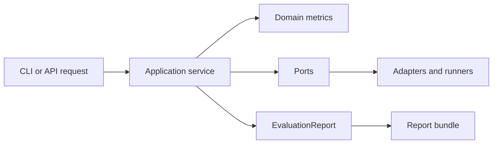
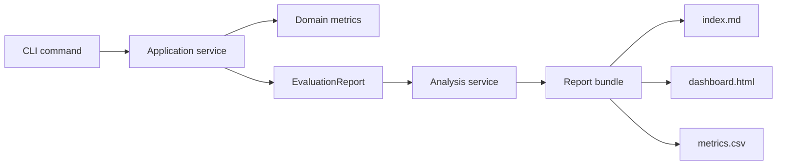

# Architecture

OVIQS follows a layered architecture: `interfaces`, `application`, `domain`,
`ports`, `adapters`, `platform` and `contracts`.

Domain code owns deterministic metric semantics. Adapters own optional
frameworks and external systems. Versioned schemas under `contracts` are public
contracts.

## Layer responsibilities

| Layer | Owns | Does not own |
|---|---|---|
| `interfaces` | CLI, HTTP and future transport entry points. | Metric math or backend-specific behavior. |
| `application` | Evaluation workflows, report packaging and orchestration. | Direct imports from optional frameworks. |
| `domain` | Metric semantics, statuses, gates and report concepts. | File formats, YAML loading or process I/O. |
| `ports` | Protocols that describe external capabilities. | Concrete implementations. |
| `adapters` | JSON I/O, renderers, runners, datasets and integrations. | Business rules hidden from ports. |
| `platform` | Composition and default container wiring. | Domain decisions. |
| `contracts` | Versioned JSON Schema files and public data shapes. | Runtime logic. |

## Reporting path

The reporting path starts with an evaluation command and ends with a bundle:

Renderers only display report and analysis data. They must not compute metric
status or invent unavailable values.

## Pre-release compatibility

Before the first stable release, legacy Python import paths are not compatibility
contracts. The repository favors the target layered layout over compatibility
shims. Persisted report schemas and bundle layout are the compatibility surface
that docs and tests should protect.
