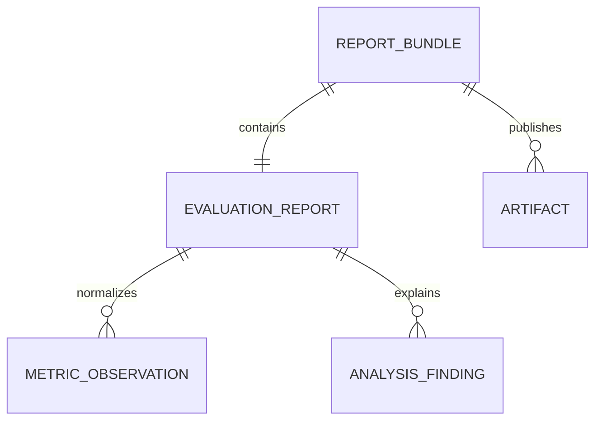

# Reporting model

Every evaluation emits a versioned `EvaluationReport`. Report bundles add a
review layer around that contract.

Renderers consume normalized report data and must not invent metrics.

## EvaluationReport

`EvaluationReport` is the canonical machine-readable artifact. It contains:

- `schema_version`;
- `run` metadata;
- `summary`;
- optional diagnostic sections such as `likelihood`, `serving`, `rag` and
  `performance`;
- `metric_references`;
- reproducibility metadata when available.

The schema is intentionally additive before the first stable release. New
sections and scalar diagnostics can be added without changing existing fields.

## Metric observations

Report analysis flattens nested diagnostic sections into normalized metric
observations. A metric observation has a path such as `likelihood.perplexity`,
the original section, the metric name, the scalar value and the current status.

Normalized observations make renderers and CI integrations simpler because they
do not need to understand every nested report shape.

## Findings

Findings turn metrics, gates and baselines into reviewable conclusions. A
finding should include severity, status, evidence paths, impact and a concrete
recommendation.

Findings are produced by analysis logic. Markdown and HTML renderers only
display them.
