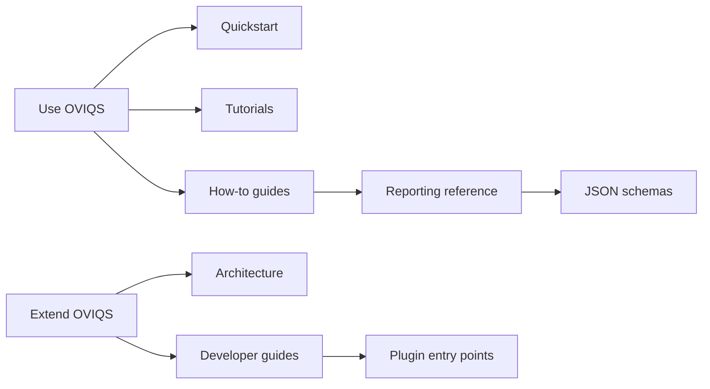

# OVIQS documentation

OVIQS is an OpenVINO-first diagnostics suite for LLM inference quality. It helps
teams run repeatable checks, keep missing evidence visible as `unknown`, and
publish report bundles that are readable in review and stable enough for
automation.

The documentation is split by work mode:

- **Use OVIQS**: install the package, run an evaluation, build a report bundle,
  validate the JSON contract and inspect Markdown or HTML output.
- **Extend OVIQS**: add metrics, analysis rules, renderers and entry points
  without crossing the domain, application, port and adapter boundaries.

Project status: pre-release. Python import paths are not compatibility
contracts before the first stable release. Versioned report schemas and bundle
layout are treated as public contracts.

## Start here

- [Quickstart](start/quickstart.md) creates a tiny dataset, writes an
  `EvaluationReport`, validates it and builds a bundle.
- [First local run](tutorials/first-local-run.md) explains the same path as a
  guided tutorial.
- [Reporting spec](reference/reporting/reporting-spec.md) defines the public
  contract behind the generated files.

## Public contracts

The most important public artifacts are:

- `EvaluationReport` JSON, validated by
  [the evaluation report schema](reference/schemas/evaluation-report.md).
- Report bundle directory, documented in
  [the bundle layout](reference/reporting/bundle-layout.md).
- CLI command behavior, generated into
  [the CLI reference](reference/cli/index.md).
- Metric references and oracles, summarized in
  [the metric reference guide](reference/metrics/references-and-oracles.md).
- Schema-valid generated examples under `docs/examples/bundles/`, including
  minimal likelihood, reference comparison, GPU smoke, gated regression and
  unknown-evidence fixtures.

Generated reference pages are rebuilt by CI. If a command, schema or example
changes, regenerate the docs artifacts before opening a pull request.
