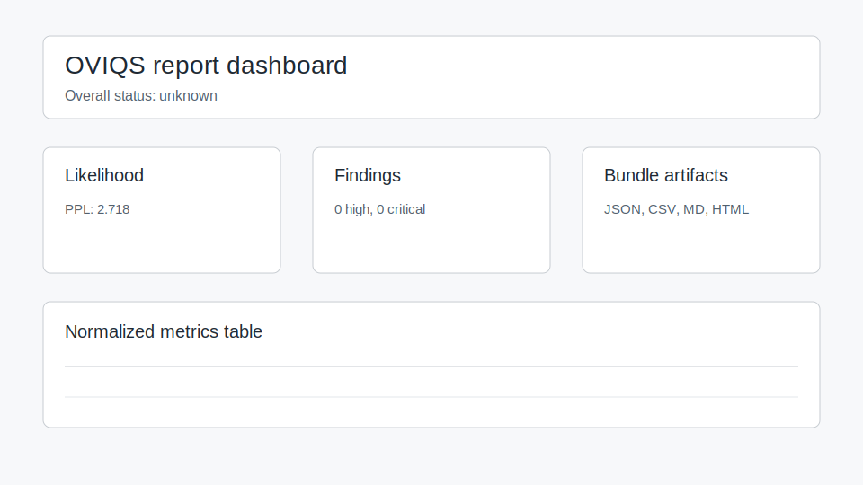
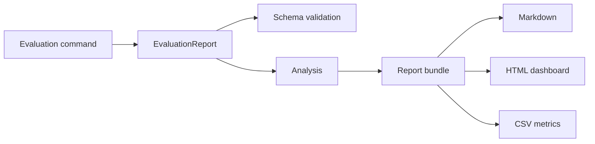

# Reporting spec

The public reporting contract starts with `EvaluationReport`.

## Required top-level fields

- `schema_version`
- `run`: run identity, suite name, creation time and optional model/device data.
- `summary`: overall status and user-facing findings.

Common diagnostic sections include `inference_equivalence`, `likelihood`,
`long_context`, `generation`, `rag`, `agent`, `serving`, `performance`, `gates`,
`metric_references` and `reproducibility`.

Add new scalar diagnostics additively. Do not reinterpret missing values as
successful checks. Missing or unsupported evidence must remain `unknown`.

## Status values

Status values are shared across report sections, metric observations and gates:

| Status | Meaning |
|---|---|
| `pass` | Evidence satisfies the configured rule. |
| `warning` | Evidence is degraded or near a threshold but not a hard failure. |
| `fail` | Evidence violates a gate or critical quality rule. |
| `unknown` | Evidence is missing, unsupported or not registered for gating. |

## Report lifecycle

`EvaluationReport` is the source of truth. Analysis and rendered views are
derived artifacts.

## Compatibility policy

Before the first stable release, Python import paths may change. The reporting
schema and bundle layout are the public contracts that should evolve
additively. If a metric cannot be computed after a refactor, keep it `unknown`
until the correct evidence path is restored.

## Produced by

- `oviq eval-*` commands;
- `oviq run-suite`;
- `oviq run-gpu-suite`;
- `oviq report build`, which copies the canonical report into a bundle.
